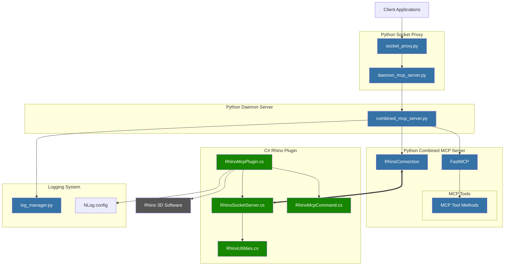

# Rhino MCP Server

> **⚠️ UNDER CONSTRUCTION ⚠️**  
> This project is currently under active development and is not yet in working order. The Rhino plugin is experiencing issues with creating objects.
> We are actively seeking support from the community to help resolve these issues.
> If you have experience with Rhino API development, C# plugins, or MCP integration, please consider contributing.
> Contact us by opening an issue on GitHub.

A Model Context Protocol (MCP) server implementation for Rhino 3D, allowing Claude to create and manipulate 3D objects.

## Overview

This project implements an MCP server for Rhino 3D that enables AI assistants like Claude to interact with Rhino through the Model Context Protocol. The server allows for the creation and manipulation of 3D objects directly from the AI interface.

## System Architecture

The system consists of Python components that implement the MCP server and C# components that integrate with Rhino. Here's an overview of how the system components interact:



For more detailed information about the system architecture, including component descriptions and data flow, see [code_architecture.md](code_architecture.md).

## Components

There are several implementations available:

1. **Combined MCP Server (Recommended)**: 
   - `combined_mcp_server.py` - Direct implementation that uses stdin/stdout for communication

2. **Socket-based Servers**:
   - `daemon_mcp_server.py` - Background server that receives commands via socket connection
   - `socket_proxy.py` - Proxy that forwards commands from stdin to the daemon server and back
   
3. **Standalone Server**:
   - `standalone-mcp-server.py` - Original standalone implementation

## Setup Instructions

### 1. Set up Claude Desktop

1. Install Claude Desktop if you haven't already
2. Configure the MCP server connection in Claude Desktop settings

### 2. Run the Server

We now have a unified server launcher that allows you to run any of the server implementations:

```bash
./server_launcher.sh [mode]
```

Available modes:
- `combined` (default) - Run the combined MCP server
- `standalone` - Run the standalone MCP server
- `daemon` - Run the daemon MCP server
- `socket-proxy` - Run the socket proxy
- `direct` - Run both daemon and socket proxy
- `logs` - View recent logs
- `monitor` - Monitor logs in real-time
- `errors` - View recent errors
- `help` - Show help message

Examples:
```bash
# Run the combined server (recommended)
./server_launcher.sh combined

# Or simply
./server_launcher.sh

# Run the socket-based approach (daemon + proxy)
./server_launcher.sh direct

# Monitor logs in real-time
./server_launcher.sh monitor
```

## Available Tools

The server provides several tools for 3D modeling:

1. **geometry_tools.create_sphere** - Create a sphere with specified center and radius
2. **geometry_tools.create_box** - Create a box with specified dimensions
3. **geometry_tools.create_cylinder** - Create a cylinder with specified parameters
4. **scene_tools.get_scene_info** - Get information about the current scene
5. **scene_tools.clear_scene** - Clear objects from the scene
6. **scene_tools.create_layer** - Create a new layer in the document

## Troubleshooting

If you encounter connection issues:

1. Make sure no old servers are running:
   ```bash
   ./server_launcher.sh help  # This will clean up existing processes
   ```

2. Check the log files:
   ```bash
   ./server_launcher.sh logs   # View logs
   ./server_launcher.sh errors # View errors
   ```

3. Restart Claude Desktop completely

## License

This project is released under the MIT License. See the LICENSE file for details. 

## Improved Logging System

The system features a unified logging framework that centralizes logs from all components:

- Server logs
- Plugin logs
- Claude AI logs
- Diagnostic logs

All logs follow a consistent format and are stored in the `logs/` directory with separate subdirectories for each component.

### Log Management

A log management tool is provided that offers powerful capabilities for viewing, monitoring, and analyzing logs:

```bash
# View logs
./server_launcher.sh logs

# Monitor logs in real-time
./server_launcher.sh monitor

# View errors with context
./server_launcher.sh errors

# Generate error reports (using the log manager directly)
./log_manager.py report
```

For detailed information on using the logging system, see [LOGGING.md](LOGGING.md).

## Development

### Project Structure

- `combined_mcp_server.py`: Main MCP server implementation
- `diagnose_rhino_connection.py`: Diagnostic tool for testing Rhino connection
- `log_manager.py`: Tool for managing and analyzing logs
- `server_launcher.sh`: Unified script to start any server implementation
- `logs/`: Directory containing all logs

### Adding New Features

1. Add new tools as methods in the `combined_mcp_server.py` file
2. Use the existing logging framework for consistent error handling
3. Update diagnostic tools if needed 