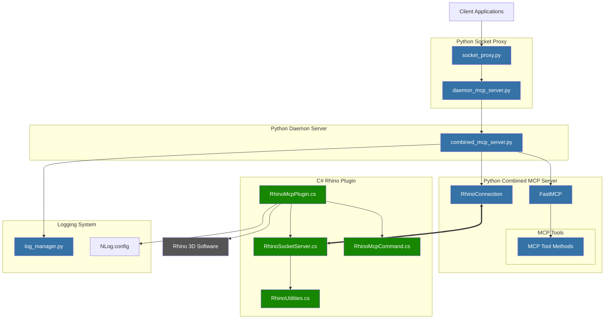

P# Rhino MCP Server - System Architecture

This diagram represents the architecture of the Rhino MCP Server system and how its components interact. This is a living document that will be updated as the project evolves.

## Component Descriptions

### Python Components
- **socket_proxy.py**: Acts as a proxy between client applications and the daemon server, forwarding stdin/stdout.
- **daemon_mcp_server.py**: Long-running daemon that manages the combined MCP server.
- **combined_mcp_server.py**: Main MCP server implementation using FastMCP pattern, providing tools for Rhino operations.
- **log_manager.py**: Handles logging across different components of the system.

### C# Components
- **RhinoMcpPlugin.cs**: Main Rhino plugin that hooks into Rhino and manages the socket server.
- **RhinoSocketServer.cs**: Socket server that listens for commands from the Python MCP server.
- **RhinoUtilities.cs**: Utility functions for Rhino operations.
- **RhinoMcpCommand.cs**: Implements Rhino commands used by the plugin.

### Data Flow
1. Client applications communicate with the socket proxy using stdin/stdout.
2. Socket proxy forwards messages to the daemon server over TCP.
3. Daemon server manages the combined MCP server process.
4. Combined MCP server processes commands and communicates with the Rhino plugin.
5. Rhino plugin executes commands in Rhino and returns results to the MCP server.

This architecture allows for resilient communication between client applications and Rhino, with the ability to restart components when needed without losing the overall connection. 